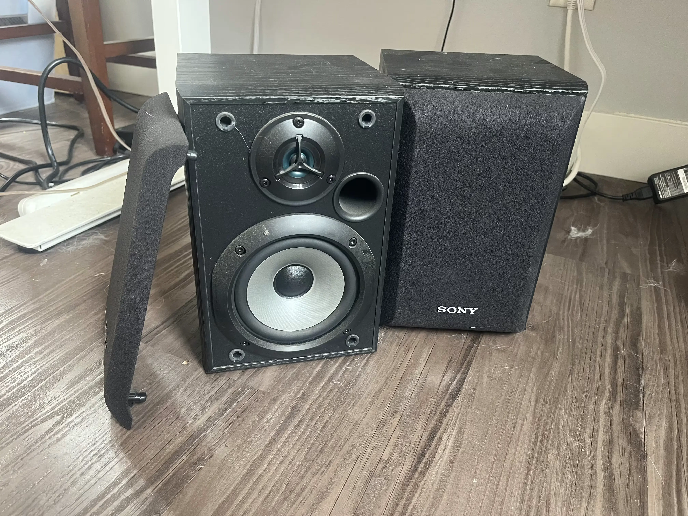

# Audio

The main reason this page was created was to get these passive speakers I found on the ground to work. It has lead to a larger development into the topic :). 

These sony speakers are normally like $60 a pair on ebay.

{: style="width: 400px"}

The **issue** you can't just plug them into your laptop, because the diaphram requires more force to push it to create audible noise (you could splice or find cables that will plug in, but would be very very low volumes).

The **solution** is that you'd have to buy (or build!) an [amp](amp/README.md).

