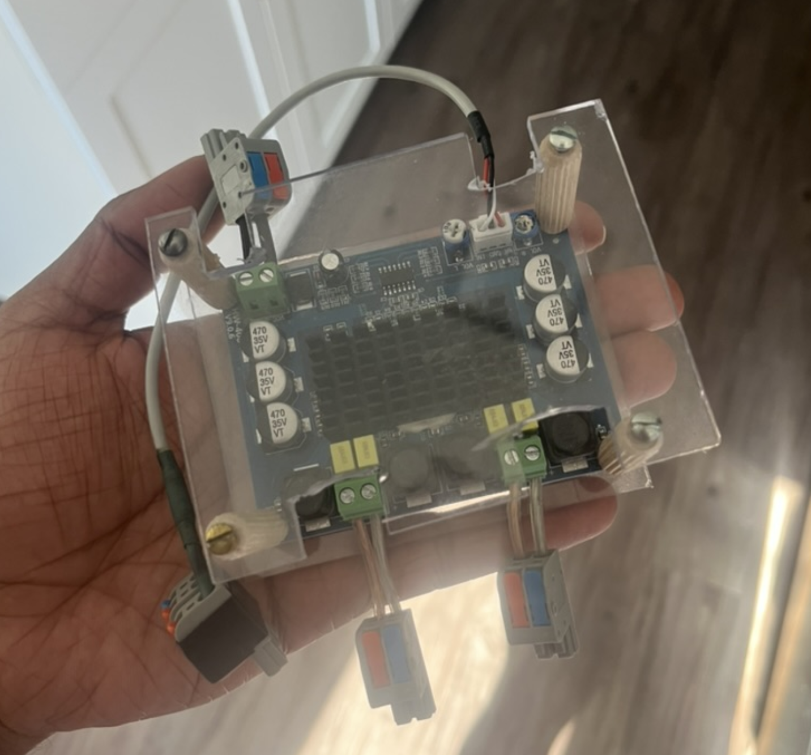

# Amp

I use this amplifier daily on my desk at the bi-weekly gamenight events. I did not design the board but did make enclosure and wiring as well as ensured all power/input/output amp specs matched the speaker specs.

{width="400"}

## Background

I found 2 desktop speakers outside my apartment while walking the dog and wanted to get them to work. So, I decided to look up how speakers work, getting deep into passive vs. active speakers, amplifiers, recifievers, digital vs. analog audio, etc, etc. 

For simplicity sake, I could have just bought a integrated amplifier, but those were more than my budget rolling around $30 for the cheapest models on Amazon. So I found a $2 amp from [aliexpress](https://www.aliexpress.us/item/3256804913221986.html?gatewayAdapt=glo2usa). I am not as cheap now as when I did this project, but often I do things to simply learn, because the time to research/build =/= cost.

I went to the [Capitol hill tool library](https://sustainablecapitolhill.org/tool-library/) and sorted through their bins of old laptop chargers and found one that works for the speaker model I found outside. I also got some cables to splice and solder to connect to power supply to plug into the purchased amplifier. The solder came from Pat, who gave it to me for burning wood at the wood carving crafts night I hosted. Later, I wanted to amplify the input power so I found a wide varied at [RE-PC](https://www.repc.com/) in sodo, South Seattle.

I started with [twist terminal cable connectors](https://www.aliexpress.us/item/3256805589637978.html?) to connect wires. Later I upgraded to these clamp on connectors that have male/female plugs [aliexpress, ](https://www.aliexpress.us/item/3256806583282247.html?) At one point, I bent the audio jack cable too much so I had the left/right speakers output the same audio. I use accessibility settings to set the output to be mono instead of stereo so you hear all acoustics still).

## Current Progress

Working on building an enclosure for the amplifier. 

- I've broken the knob to adjust the volume for the right speaker
- Using polycarb for $1 from tapplastics scrap plastics bin out in Bellevue, WA. 

## Amp Specs

**Amp Name:** # 1PCS DC12-26V 2x120W Dual Channel Digital Stereo Audio Power Amplifier Board High Power CS8673 DIY 240W Amplificador Sound Board

- Model #: CS8673 Digital Audio Power Amplifier Board
- Working Voltage: DC12-26V
- Channels: 2
- Maximum Power Per Channel: - 101-130W
- Output power: 120x2W MAX
- DC12V: 2x50W  
- DC24V: 2x120W - 240/24 = 10amps
- Signal to noise ratio: 100db
- Size; 92x68x16mm
- 3P audio input

## Amp Spec?

- Item Type: Digital Amplifier Board
- Material: PCB
- Chip Type: TDA3116D2
- Supply Voltage: DC12-24V (inside positive outside negative)
- Supply Current: > 3A
- Output Power: 120W x 2
- Number of Channels: Dual Channel (treble and bass adjustment)

{: style="width: 350px"}
{: style="width: 350px"}
{: style="width: 350px"}
{: style="width: 350px"}

## Changes to be made

Currently I don't actually maximize the input power into the amp. I think it cannot draw enough current but I don't remember... I research this on July 4th 2025 and its been a few months...

Here are the notes for it tho:

- Need: 15 volt charger w/ 7.5 amps

20 volt input

- 8 ohm resistance
- 2.5 amps*** each 
- 50 watts

20 volt inout

- 8 ohm resistance
- 2.5 amps*** each
- 50 watts

max 120 watts

Recently bought a subwoofer - 6ohms

- 70W rms ?
- 10% thd 6ohms 100 hz

