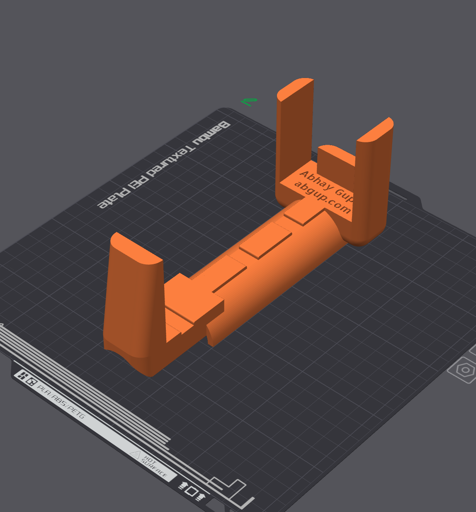
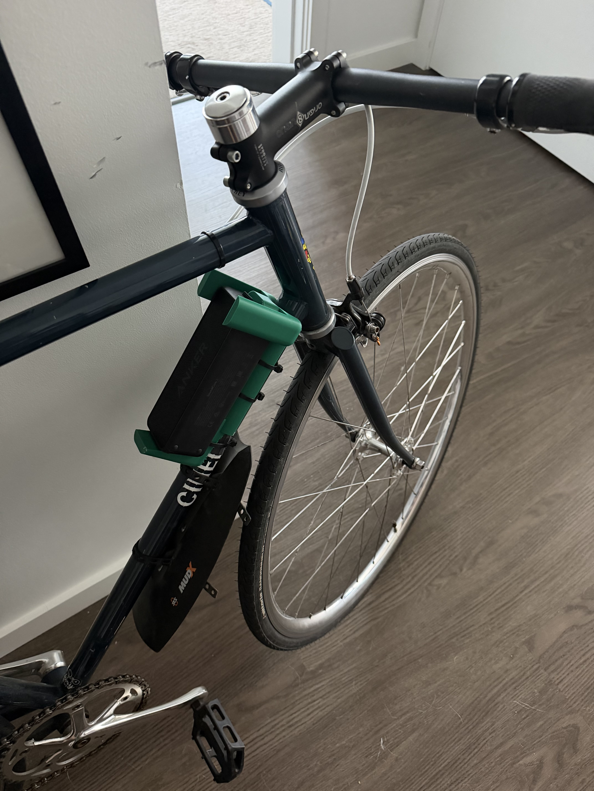

# Bicycle Speaker Mount

There isn't really a speaker system in built into bikes. Maybe some ebikes have a speaker, but idk....

Anyways, have done this multiple times where I measure a portable speaker and 3D print a mount for it to attach to my bike. I use a cut up section of old inner tube to increase friction against frame, but might be unneceesary if tighter clamp.

Clamp is made through zip ties, but I think either a bolted method or hose clamps would secure it much better (and look nicer!)

{: style="width: 300px"}
{: style="width: 300px"}

