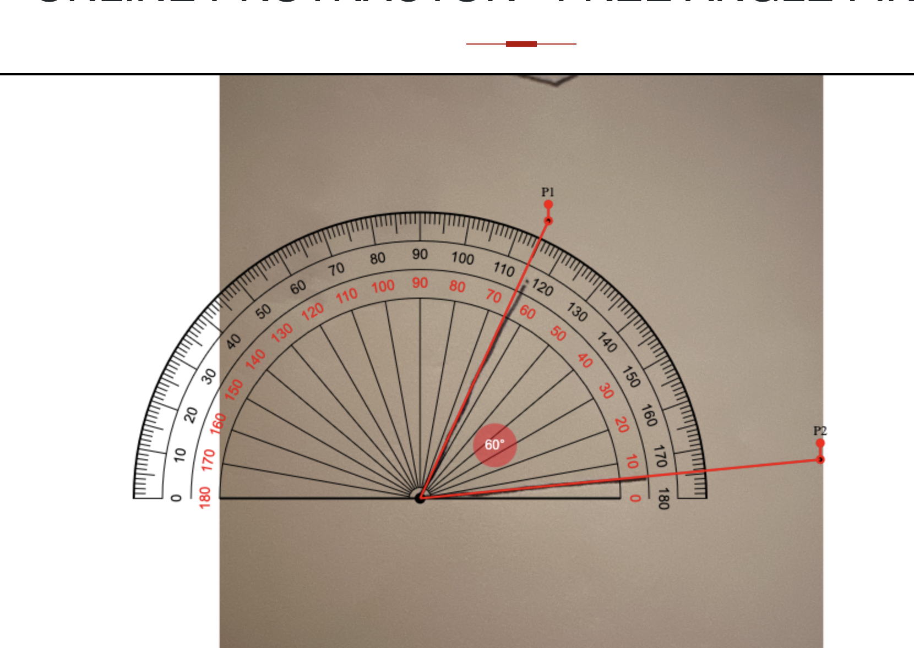
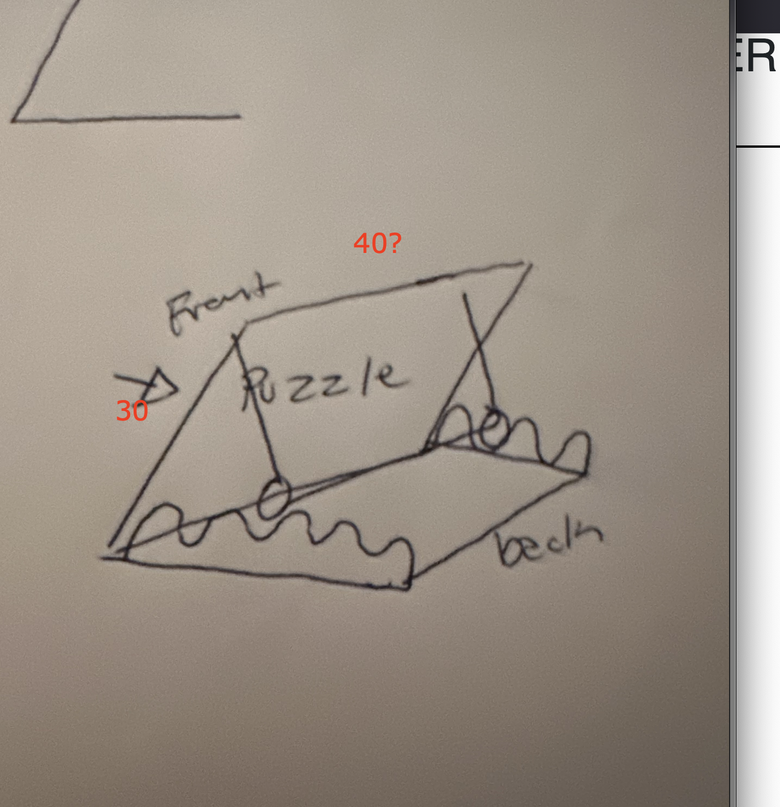
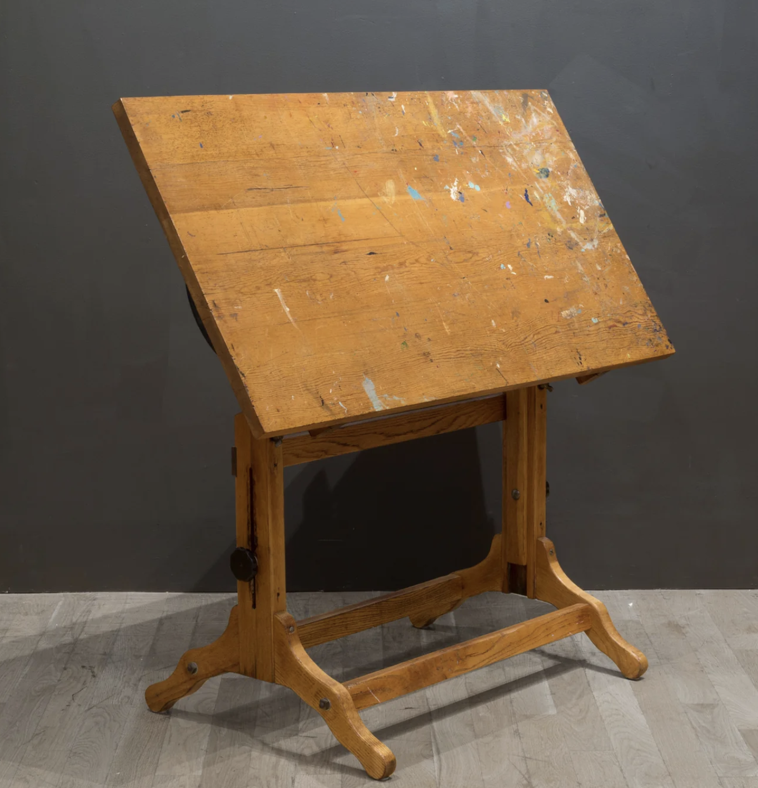
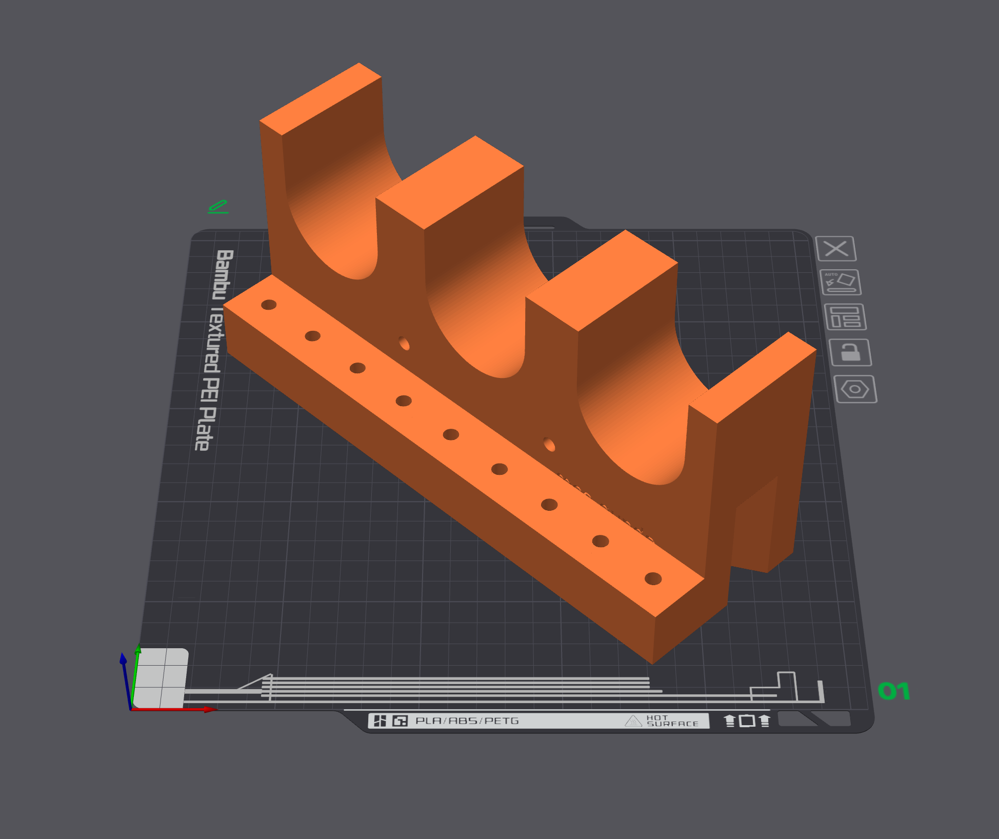
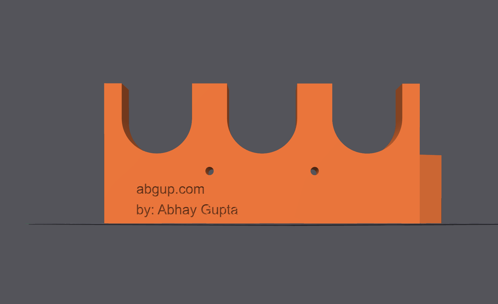

# Puzzle Table

Elizabeth is making a puzzle table. Angle for table should reach 60 degrees.

- Table size: 40"x30"
- 3D print the ratcheting hinge. 

## Idea

{width=350}
{width=300}

## Example

{width=300}

## CAD

{width=300}
{width=300}

