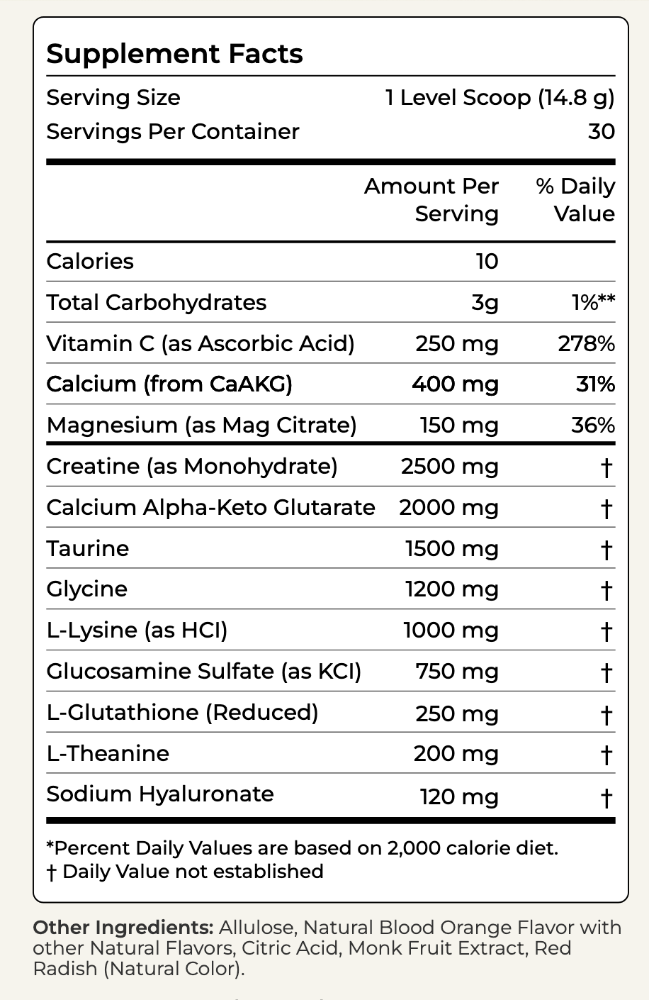

# Supplements

Bryan Johnson's [Longevity Mix](https://blueprint.bryanjohnson.com/products/longevity-blend-multinutrient-drink-mix-blood-orange-flavor) (consume in morning)

{: style="width:300px"}

- CaAKG 
    - supports energy production and healthy aging
- Creatine (monohydrate)
    - supports muscle performance, strength & recovery*
- Glycine
    - amino acid that promotes relaxation, sleep, and metabolic function*
- L-Theanine
    - amino acid that supports focus, mood, and stress resilience*
- L-Glutathione (reduced)
    - tripeptide antioxidant that helps neutralize free radicals*
- Sodium Hyaluronate
    - supports skin hydration and tissue health*
- Vitamine C (ascorbic acid)
    - supports immune function*
- L-Lysine
    - amino acid that supports bone strength and calcium absorption
- Taurine
    - amino acid that supports heart health and metabolism*
- Glucosamine (Sulfate KCI)
    - supports cartilage, joints, & skin*
- Magnesium (citrate)
    - supports sleep, mood, and muscle function*

Extra:

- Calcium
    - healthy bones and teeth*
- Monk Fruit
    - A natural zero-calorie sweetener that is metabolically neutral*
- Allulose
    - low-calorie rare sugar to support blood sugar metabolism*
