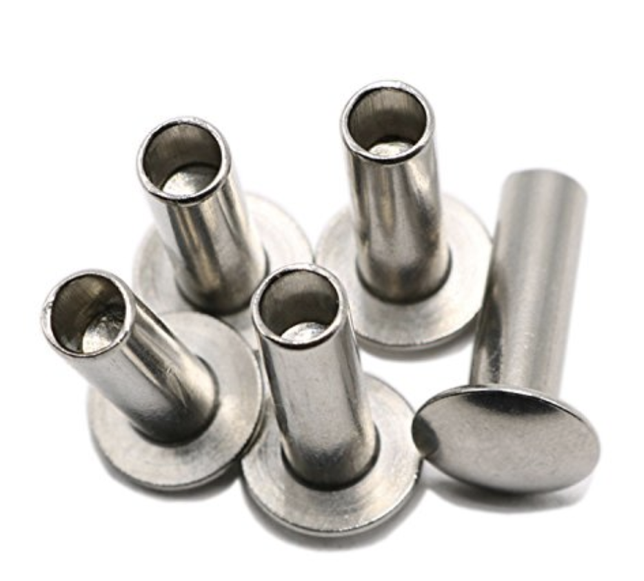
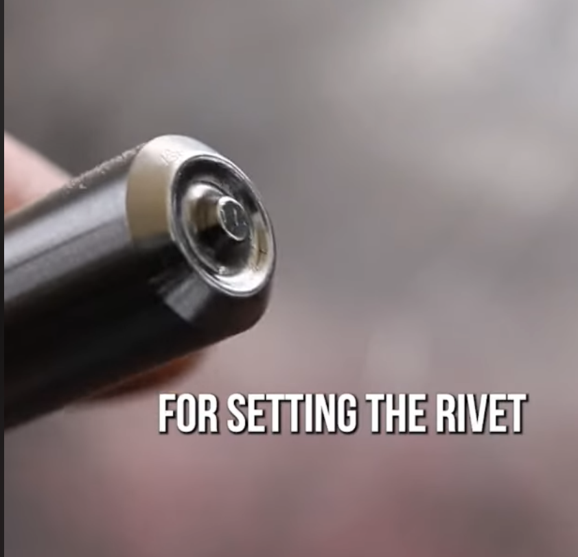
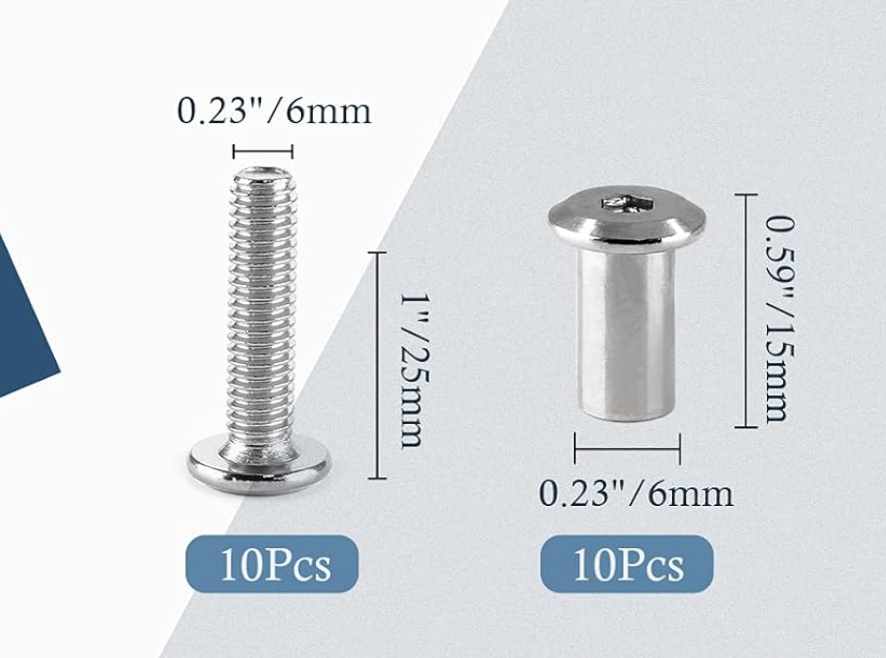

### Rivets

#### Semi Tubular Rivets

Semi-tubular rivets (also known as tubular rivets) are essentially the same as solid rivets, but with a shallow hole at the tip, opposite the head. 

- This hole causes the tubular portion of the rivet (around the hole) to roll outward with force
- This reduces the amount of force needed for installation—tubular rivets require roughly ¼ the force of solid rivets.
- [ytb short - pop rivet inside tubular rivet](https://www.youtube.com/shorts/3JCqJCKxUUg)
- [ytb short - semitubular punch install](https://www.youtube.com/shorts/fKvkP3poVog)
- [ytb short - cross-section video punch](https://www.youtube.com/watch?v=I40ISVkF08s)

{width="300"}
{width="280"}
{width="350"}

### Videos

- [Good rivet tutorial](https://www.youtube.com/watch?v=ZyWqWJKAV6k)
- [Punch method - rivets](https://www.youtube.com/watch?v=uh4oUxCzVbw)
    - [https://www.youtube.com/shorts/fKvkP3poVog](https://www.youtube.com/shorts/fKvkP3poVog)
- [ytb -  How To Use A Riveter or Rivet Gun - Ace Hardware - 4min](https://www.youtube.com/watch?v=yW3k3_sbkyc)
- [ytb - push rivet - 1min](https://www.youtube.com/watch?v=2uxTrkzf6SE)
- [ytb -  A Step-By-Step Guide on How to Use POP Rivets | Fasteners 101 - 14min](https://www.youtube.com/watch?v=1G8lGECOe1U) 
    -  Most in-depth video
- [Semi Tubular Rivet but use solid rivet to seal](https://www.youtube.com/shorts/ZOO4hiNArGI)
- [Semi Tubular Rivet diagram](https://www.youtube.com/watch?v=LKWtTZmXQ90)
- [Pop Rivet diagram](https://www.youtube.com/watch?v=9aoXmzdSf_I)

## Thoughts

- Can I just use rivets with threads and put a bolt through?
- [https://www.youtube.com/shorts/RAVH4-h1cPA](https://www.youtube.com/shorts/RAVH4-h1cPA)
- So then we can re-use half when half breaks

## Citations

- [https://www.rivetsonline.com/rivets/semi-tubular-rivets](https://www.rivetsonline.com/rivets/semi-tubular-rivets)
- [ytb short - puck comparision](https://www.youtube.com/shorts/sJTnaBffoCU)

