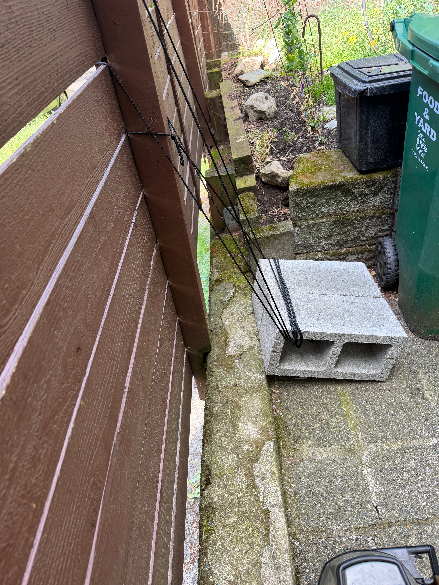
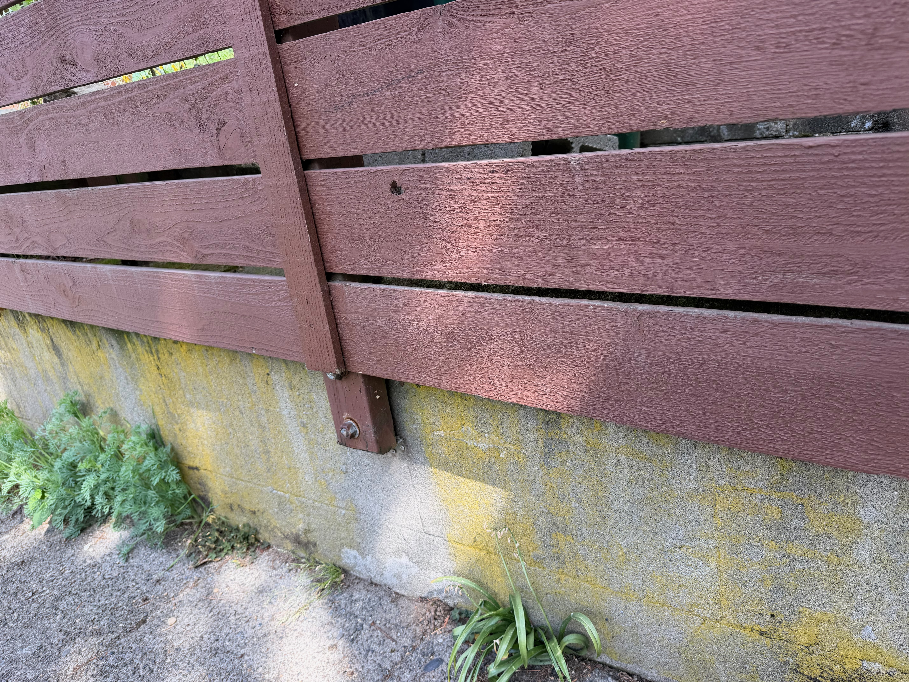
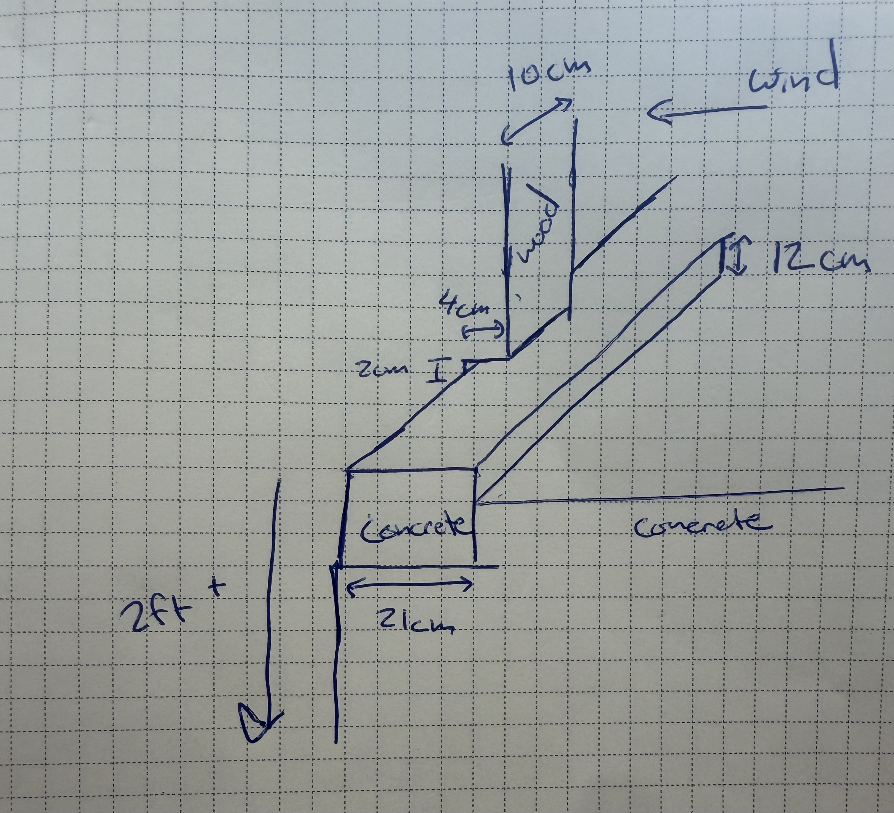

# Fence

## Fence Repair

Alex's fence was held by screws into a concrete slab and ripped out. 

{: style="width:300px"}
{: style="width:300px"}

1. Posted on reddit for solution:
    - [https://www.reddit.com/r/FenceBuilding/comments/1tlnlis/comment/oo3x97z/?screen_view_count=2](https://www.reddit.com/r/FenceBuilding/comments/1tlnlis/comment/oo3x97z/?screen_view_count=2)
    - [Simposon bracket post ties, ytb short](https://www.youtube.com/shorts/gFh62cUFI0U)
    - [Epoxy set bolt, ytb short](https://www.youtube.com/shorts/360s3xWy4jA)
2. Alex recommended a Z-bracket
    - {: style="width:300px"}
    - Issue is that the bracket won't hold
    - Fence falls south so bracket will just lift up with the fence falling...
    - Needs to be on outside to prevent it from leaning
        - Could just put a long steel/aluminum/wood rod to hold it, but may have too much flex in wood
3. Brackets
    - Make my own bracket by buying steel plates
    - [home depot $12](https://www.homedepot.com/p/4-in-x-1-ft-1-4-in-Thick-Plain-Steel-Plate-Metal-Stock-3000/340452497)
        - [home depot search results](https://www.homedepot.com/b/Hardware-Metal-Stock-Flat-Bars/N-5yc1vZ2fkos9s/Ntk-elasticplus/Ntt-steel?Ntx=mode+matchpartialmax&NCNI-5&visNavSearch=steel-_-2-_-5295306016)
    - online metals
        - [stainless steel rectangular bar](https://www.onlinemetals.com/en/buy/stainless-steel-rectangle-bar?q=%3Asize%3AMaterial%3AStainless%2BSteel%3AShape%3ABar-Rectangle%3AThickness%3A0.25%2522)
            - doesn't need to be stainless, overkill, but most corrosion resistant. 
                - Galvanized is cheaper and fine
    - bend with vice (bikery or tool library)
4. Wooden/Metal brace
    - I want to just create a double U bracket on both sides of fence post
    - And use metal L brackets to attach them together and to the fence

