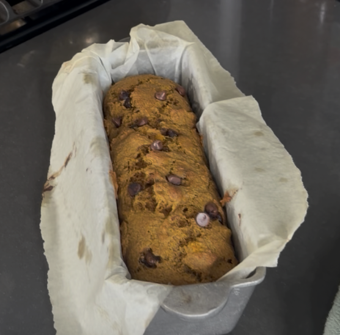
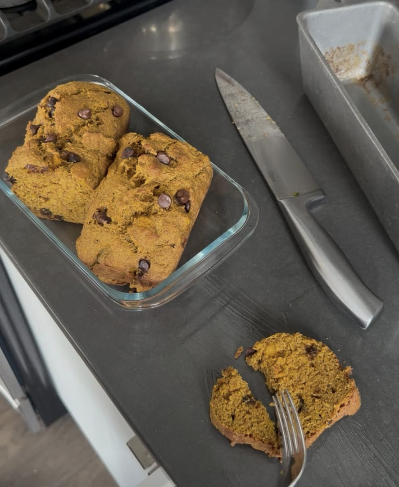

# Pumpkin Bread

{width=300px}
{width=300px}

- [https://www.youtube.com/watch?v=arUQ3ZEhhYE](https://www.youtube.com/watch?v=arUQ3ZEhhYE)
- [https://preppykitchen.com/pumpkin-bread/](https://preppykitchen.com/pumpkin-bread/)

Less sugar if chocolate chips added

## Steps

1. Mix dry ingredients in 1 bowl
2. Mix wet in another bowl
3. Pour wet over dry and fold over into parchment paper loaf pan
4. Add "Add ons"
5. Bake at 350F for 1 hr

## Ingredients

Dry Ingredients

- 1 tsp Baking Powder
- 1/2 tsp Baking Soda
- 1/2 tsp Salt
- 1 1/4 cup Sugar or mix w/ brown sugar (250g)
- 1 1/3 cup Flour (210g)
- 1/4 tsp nutmeg (whole? grated/chopped)
- 2 tsp cinnamon

Wet Ingredients

- 1 tsp Vanilla (splash)
- 2 Eggs
- 2/3 cup Oil (or some fat)
- 1 1/3 cup Pumkin Puree (125g)
    - [https://preppykitchen.com/pumpkin-puree/](https://preppykitchen.com/pumpkin-puree/)
    - Just cut pumpkin in half and put in parchment paper/aluminum foil backing sheet
    - 400F for 40-60 minutes until pierceable by fork
    - Puree in blender or food processor

## Add ons

- Chocolate Chips
- Toasted walnuts

## Types of Pumpkin

- Kabocha - sweetest, so can use less
- Carving pumkins are bland
- Orange eating pumpkins are fine!

## Leftover Pumpkin

The first is to save the leftovers. Spoon it into a container (about 125g) and keep it in the fridge for up to five days. You can stir it into oatmeal, pancake batter, or a smoothie, add it to cream cheese frosting or buttercream, or use it as an egg replacer in certain recipes.
