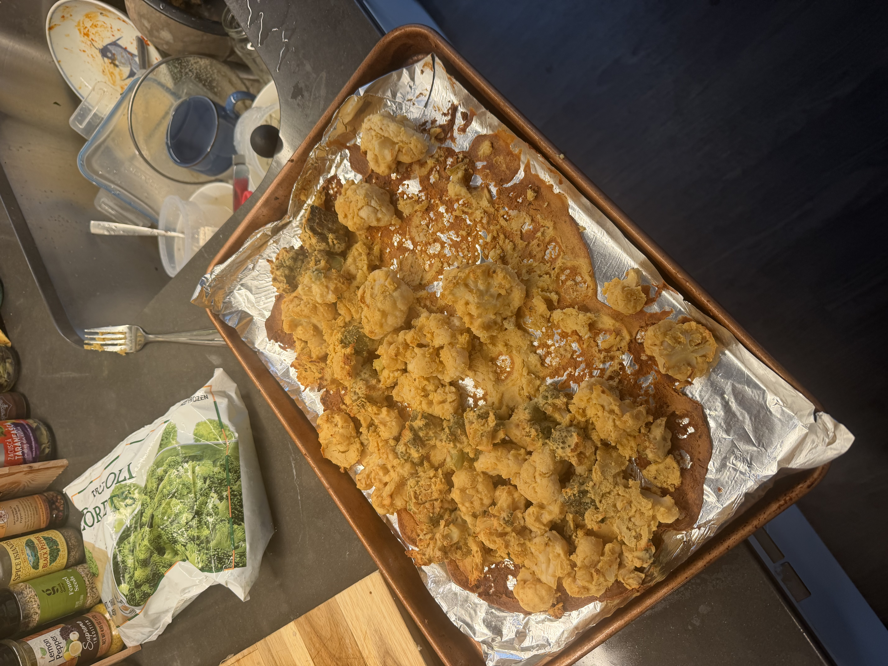
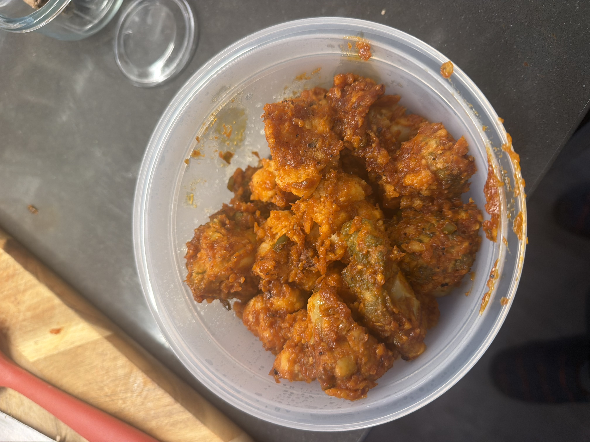
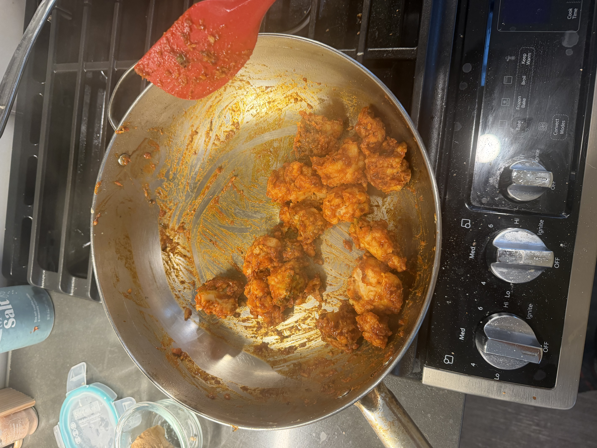

# Gobi Manchurian

[https://www.youtube.com/shorts/XHm6Vr8qWQw](https://www.youtube.com/shorts/XHm6Vr8qWQw)

The video shows a wrap, but able to just cook it!

{width="200"}
{width="200"}
{width="200"}

## Ingredients

Base

- cauliflour
- besan flour
- water

Optional Base Adds

- Baking powder
- salt 
- Kashmiri chili powder (or chili powder)
- black pepper
- ginger powder

Sauce

- ketchup!
- soy sauce or miso paste
- chili sauce (siracha, chili garlic, or similar)
- rice vinegar or black vinegar (or any vinegar...)
- garlic
- ginger
- onion
- bell peppers!

Optional Sauce Adds

- green chilies (great add :) )
- cornstarch w/ water (makes sauce thicker/stickier)
- Shaoxing wine (adds alcohol so I avoid)
- sesame oil! (great add :) ) 

## Recipe

1. Mix besan flour and water in bowl
2. Add spices, but can just add to sauce later
3. Add cut caulifour, broccoli, or any base you want :)
4. Bake at 400C, flip at 20min
5. Fry sauce and then mix baked cauliflower together
