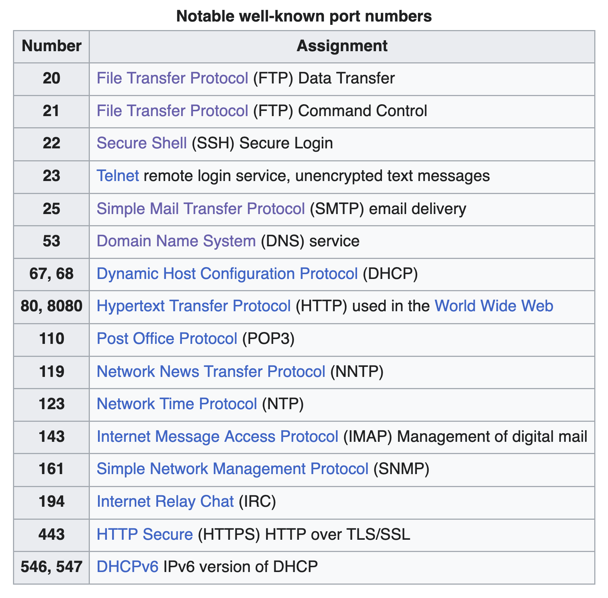

# Ports

In computer networking, a port or port number is a number assigned to uniquely identify a `connection endpoint` and to direct data to a specific service

Port numbers are connected to an `IP address` and often use either `TCP` or `UDP` transfer protocols. Thats why you have TCP/IP for internet!

There are 65,535 TCP ports available

- Port numbers are 16-bit unsigned integers
- 0–1023 are well-known ports 
    - used by system-level things like HTTP, HTTPS, SSH
- 1024–49151 are registered ports 
    - often used by apps like MkDocs, Django, etc
- 49152–65535 are ephemeral/dynamic ports 
    - used temporarily by apps for short-term connections



### Check Ports Used

On MAC:
```
lsof -i -P -n | grep LISTEN
```

## Citations

- [https://www.wikiwand.com/en/articles/Port_(computer_networking)](https://www.wikiwand.com/en/articles/Port_(computer_networking))
- [https://en.wikipedia.org/wiki/Port_(computer_networking)](https://en.wikipedia.org/wiki/Port_(computer_networking))


